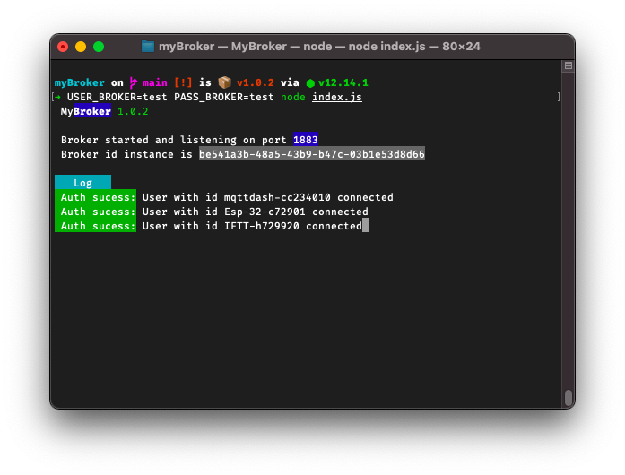

# myBroker


Create an MQTT broker easily. With myBroker creating a broker on-premises or in the cloud just got simpler.

## Installation

To make it work is very simple, first [download]("https://github.com/natandiasm/mybroker/archive/refs/heads/main.zip") or clone this repository:

```bash
git clone https://github.com/natandiasm/mybroker.git
```

Then go to the folder where the project is and run:

```bash
node install
```

And ready 🎉

## Usage
If you don't want to use passwords at your broker, just run:
```bash
node start
```
If you want your broker with a user. create the environment variables
```bash
USER_BROKER = username
```
If you want to enter a password, create: 
```bash
PASS_BROKER = password
```
Then run
```bash
node start
```
Or run at once:
```bash
USER_BROKER=youruser PASS_BROKER=yourpass node index.js
```
## Contributing
Pull requests are welcome. For major changes, please open an issue first to discuss what you would like to change.

Please make sure to update tests as appropriate.

## License
[MIT](https://choosealicense.com/licenses/mit/)